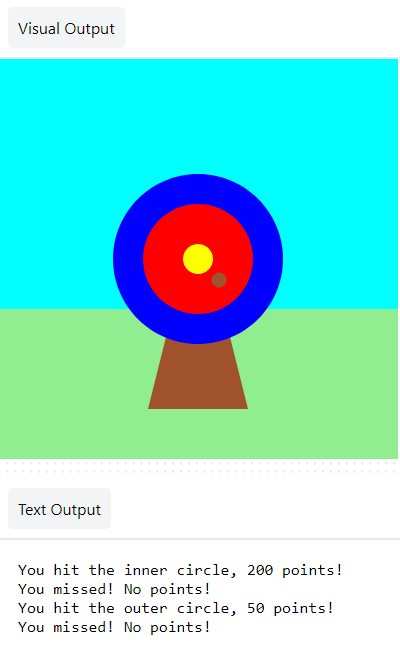

## You will make

Use Python, with the `p5` graphics library, to draw a target and score points by hitting it with arrows. 

You will:
 + Personalise your game with colours
 + Use **conditional statements** (`if`, `elif`, `else`) to make decisions
 + Position shapes with **x, y coordinates**

--- no-print ---

### Play ▶️

--- task ---

  
Click the **Run** button below to start the game. When the dot appears on the target 🎯, click the mouse (or tap on your tablet) to fire your arrow. 

Have a few goes. Your score appears in the output area below the target. How does your score change when the arrow lands on the different colours? 
  <iframe src="https://editor.raspberrypi.org/embed/viewer/yarns-beings-rowdy" width="1024" height="768" frameborder="0" marginwidth="0" marginheight="0" allowfullscreen>
  </iframe>

--- /task ---

--- /no-print ---

--- print-only ---

--- /print-only ---

The oldest evidence of  archery  comes from the Sibudu Cave in KwaZulu-Natal, South Africa. Remains of stone and bone arrowheads have been found, which date to between 60,000 and 70,000 years ago. 

