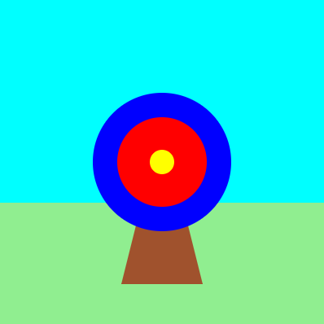
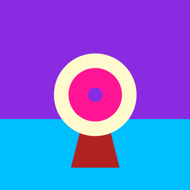

## Draw your target

Your game needs a target to shoot arrows at.

{:width="300px"}

### Draw a triangular stand

--- task ---

Set the fill colour to `wood` (brown). 

Draw a triangle using the x and y coordinates for each of the corners.

{:width="400px"}

--- code ---
---
language: python
filename: main.py - draw()
line_numbers: true
line_number_start: 27
line_highlights: 29, 30
---
  fill(grass)   
  rect(0, 250, 400, 150) 
  fill(wood) # Set the stand fill colour to wood     
  triangle(150, 350, 200, 150, 250, 350)

--- /code ---

--- /task ---

--- task ---

**Test:** 🔄 Run your code to see the stand for your target: 

{:width="400px"}

--- /task ---

### Draw the target circles

--- task ---

The largest part of the target is a blue **circle**.

Set the fill colour to `outer` (blue). 

Draw a circle with x and y coordinates for its centre and a width. 

{:width="400px"}

--- code ---
---
language: python
filename: main.py - draw()
line_numbers: true
line_number_start: 29
line_highlights: 31, 32
---

  fill(wood)   
  triangle(150, 350, 200, 150, 250, 350)   
  fill(outer) # Set the circle fill colour to outer    
  circle(200, 200, 170) # x, y, width of the circle
  
--- /code ---

--- /task ---

--- task ---

**Test:** Run your code to see the first large blue circle. 

The blue circle was drawn after the stand so it is in front:

{:width="400px"}

--- /task ---

--- task ---

👀 Find your colour variables in the `draw` function. 

Create two variables called `inner` and `middle` to store colours for the other circles. 

The `color` function expects three numbers: one each for red, green, and blue.

--- code ---
---
language: python
filename: main.py - draw()
line_numbers: true
line_number_start: 17
line_highlights: 24, 25
---
def draw():   
  # Things to do in every frame
  global wood
  sky = color(92, 204, 206)   
  grass = color(149, 212, 122)   
  wood = color(145, 96, 51)   
  outer = color(0, 120, 180) # Blue    
  inner = color(210, 60, 60) # Red    
  middle = color(220, 200, 0) # Yellow    

--- /code ---

--- /task ---

The target is made of different-sized circles with the same centre coordinates (200, 200). 

--- task ---

**Add** coloured circles for the inner and middle parts of the target. 

--- code ---
---
language: python
filename: main.py - draw()
line_numbers: true
line_number_start: 31
line_highlights: 35, 36, 37, 38
---
  fill(wood)    
  triangle(150, 350, 200, 150, 250, 350)  
  fill(outer)   
  circle(200, 200, 170)
  fill(inner) # Set the circle fill colour to inner      
  circle(200, 200, 110) # Inner circle - x, y, width of the circle  
  fill(middle) # Set the circle fill colour to middle      
  circle(200, 200, 30) # Middle circle - x, y, width of the circle 
  
--- /code ---

--- /task ---

--- task ---

**Test:** 🔄 Run your project to see the target with three coloured circles. 

{:width="400px"}

**Debug:** 🐞 Check that you have used the American spelling of 'color' (without a 'u').

--- /task ---

--- task ---

**Choose:** 💭 Change any of the colours.

[[[generic-theory-simple-colours]]]

{:width="400px"}

--- /task ---

