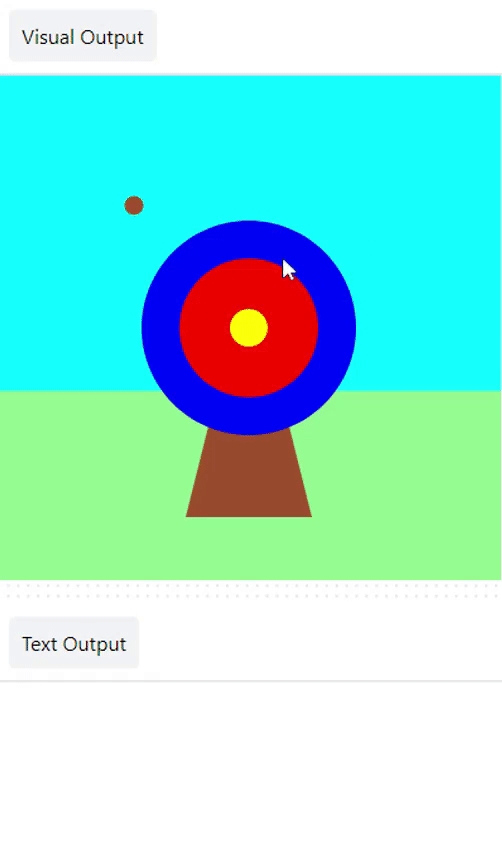
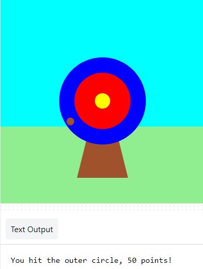
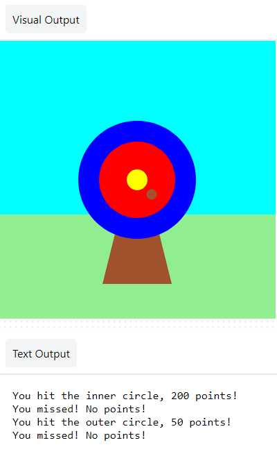
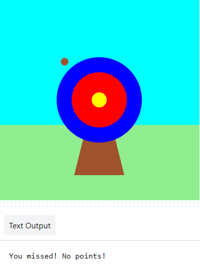

## Score points

Your game will add scores based on where the arrow hits.

{:width="300px"}

We use  conditions all the time to make decisions. We could say 'if the pencil is blunt, then sharpen it'. Similarly, `if` conditions let us write code that do something different depending on whether a condition is true or false.

### Display the scores

--- task ---

<mark>Delete ❌ the `print( red(hit_color), green(hit_color), blue(hit_color) )` line of code. </mark>

--- code ---
---
language: python
filename: main.py - mouse_pressed()
line_numbers: true
line_number_start: 5
line_highlights: 7
---
# The mouse_pressed function goes here    
def mouse_pressed():    
  

--- /code ---

--- /task ---

--- task ---

`print` a message `if` the `hit_color` is equal to `outer` 🎯. 

Notice 👀 that the code uses two equals signs `==` to mean **equal to**.

--- code ---
---
language: python
filename: main.py - mouse_pressed()
line_numbers: true
line_number_start: 5
line_highlights: 7, 8
---

# The mouse_pressed function goes here     
def mouse_pressed():     
    if hit_color == Color('blue'): # Like functions, 'if' statements are indented    
        print('You hit the outer circle, 50 points!')

--- /code ---

--- /task ---

--- task ---

**Test:** 🔄 Run your project. Try to stop the arrow on the blue outer circle to see your message. 

**Tip:** 💡 `frame_rate=2`, in `run` at the bottom of your code, controls how fast your game draws. If it's going too fast, set it to a lower number. 

**Debug:** 🐞 Make sure your code matches exactly and you indented the code inside your `if` statement. 

--- /task ---

`elif` (else - if) can be used to add more conditions to your `if` statement. These will be read from top to bottom. As soon as a **True** condition is found, it will be actioned. The remaining conditions will be ignored.

--- task ---

Score points if the arrow lands on the `inner` or `middle` circles 🎯: 

--- code ---
---
language: python
filename: main.py - mouse_pressed()
line_numbers: true
line_number_start: 6
line_highlights: 9, 10, 11, 12
---

def mouse_pressed():
    if hit_color == Color('blue'):
        print('You hit the outer circle, 50 points!') 
    elif hit_color == Color('red'):    
        print('You hit the inner circle, 200 points!')   
    elif hit_color == Color('yellow'):    
        print('You hit the middle, 500 points!')   

--- /code ---

--- /task ---

--- task ---

**Test:** 🔄 Run your project. Try to stop the arrow on the inner and middle circles to see their messages.

**Debug:** 🐞 Check your indentation matches the example.

**Debug:** 🐞 If you see a message about `inner` or `middle` being 'not defined', then go back to `draw()` and check that they are on the line that declares variables global.

--- /task ---

### Missing the target

There is one more decision you need to make: what happens if the arrow does not land on any of the target circles? ❌

To do this last check, you use `else`.

--- task ---

Add code to `print` a message `else` none of the `if` and `elif` statements have been met.

--- code ---
---
language: python
filename: main.py
line_numbers: true
line_number_start: 6
line_highlights: 13, 14
---

def mouse_pressed():
    if hit_color == Color('blue'): # Like functions, 'if' statements are indented 
        print('You hit the outer circle, 50 points!') 
    elif hit_color == Color('red'):    
        print('You hit the inner circle, 200 points!')   
    elif hit_color == Color('yellow'):    
        print('You hit the middle, 500 points!')   
    else:   
        print('You missed! No points!') 

--- /code ---

--- /task ---

--- task ---

**Test:** 🔄 Run your project. Try to stop the arrow in the grass or sky to see the miss message. 

**Choose:** 💭 Change the number of points scored for the different colours if you like.

--- /task ---

